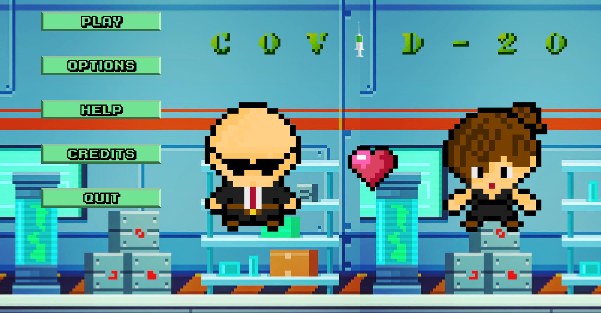
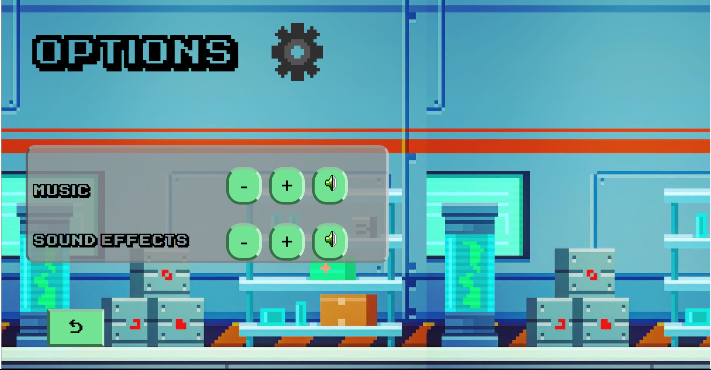
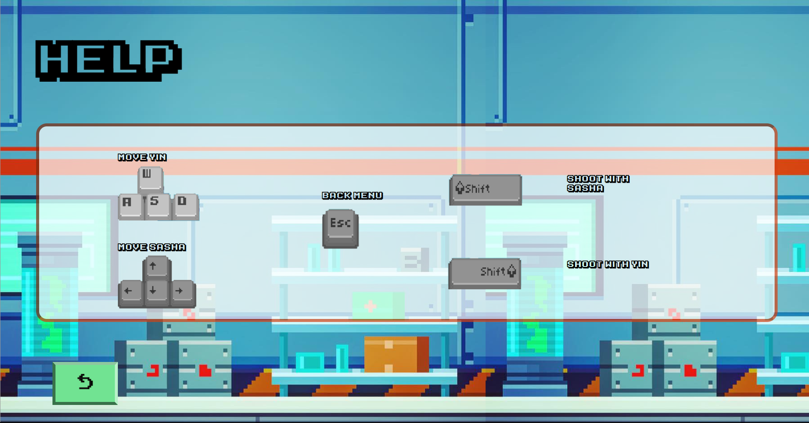
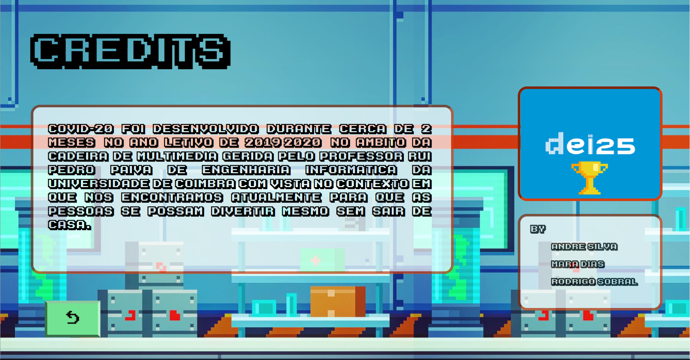
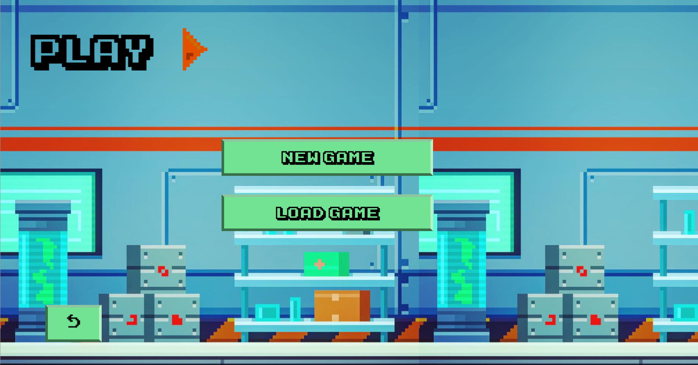
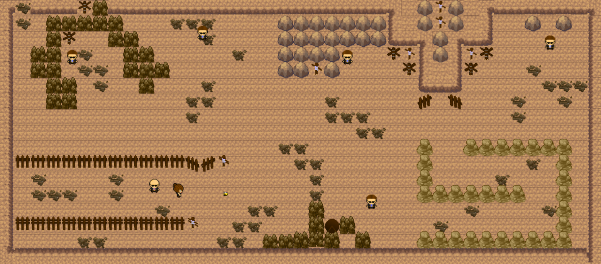

# Covid 2020 Game :mask:

___

##    About :clipboard:

USA are acusing China of the spread of the coronavirus but China is trying to prove it has no fault about the actual pandemic and apocalyptic global situation.

So China built strong connections to Russia and began searching for the true.

So now, they're recruited two secret agents, Yin and Sasha, to spying USA, it's laboratories and projects.

What will happen if China is right? Will they be able to prove it? :anguished:

___

## Used Technologies :computer:

    

___

##    Main Menu :house:

##    Options :wrench:

##    Help :sos:

##    Credits :scroll:

##    Play Menu :arrow_forward:

##    GamePlay :video_game:

___

## **Contributors** :sparkles:

<html><i><b> Licenciatura Engenharia Informática - Universidade de Coimbra 
Multimédia - 2019/2020  
Coimbra, 25 de maio de 2020
</b></i></html>

:mortar_board: *[Rodrigo Sobral](https://github.com/RodrigoSobral2000)*
:mortar_board: *André Silva*
:mortar_board: *Mara Dias*

___

## License :link:
Have a look at the [license file](LICENSE) for details
___
